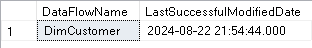
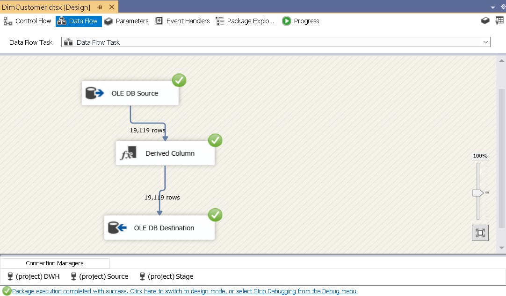
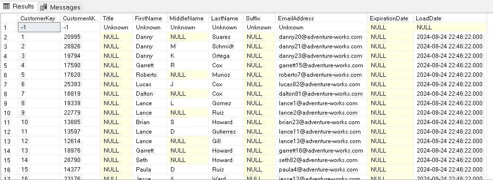
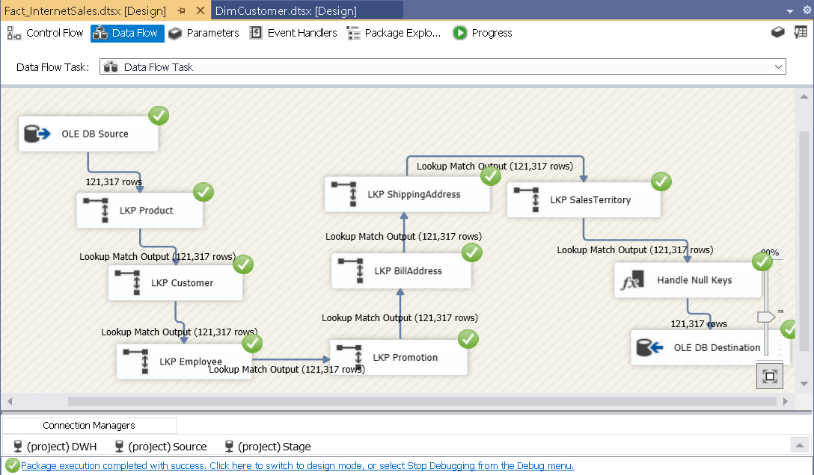
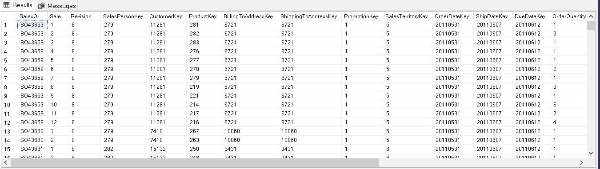

## AdventureWorks_DWH Project
This project aims to build an Internet Sales Data Mart by extracting, transforming, and loading data from the AdventureWorks 2019 database. The data mart is designed using a star schema, comprising the following dimensions: `DimPromotion`, `DimProduct`, `DimSalesTerritory`, `DimGeography`, `DimCustomer`, `DimEmployee`, `DimDate`, and a fact table: `FactInternetSales`. The ETL process is implemented using SQL Server Integration Services (SSIS) within Visual Studio.

## Data Source
Data source can be downloaded from here! [AdventureWorks2019.bak](https://github.com/Microsoft/sql-server-samples/releases/download/adventureworks/AdventureWorks2019.bak)

## Internet Sales Diagram


<p align="center">Internet Sales Diagram of the Project</p>

## Data Mapping 
The source-target of dimension and fact tables are predefined. For instances, DimCustomer is defined as figure below:


<p align="center"> Mapping Customer Source and Customer Destination (DimCustomer) </p>

## Data Modelling
### Create Dimension and Fact Tables


<p align="center">Initial Fact Table Script</p>

### Set Primary and Foreign Constraints 
- Eg: set primary key for `DimPromotion`

``` diff
ALTER TABLE DimPromotion 
ADD CONSTRAINT PK_DimPromotion PRIMARY KEY (PromotionKey);
```

## ETL Process
### Create Staging Database
Create Customer and Geograpy Staging Table. Reffering to `scripts/create-staging.sql`
### Create Data Flow Metedata for Incremental Load
Reffering to `scripts/MetaDataFlow.sql`



<p align="center">Data Flow Record</p>

### Insert Unknown Member Stored Procedures
**Reffering to `procedures` folder.**

To solve the issue Early arriving facts or Late arriving dimensions, we inserted an unknown member for each dimension. The aim of which is to ensure all source data flows into your fact tables. This is essentially a catch-all for any fact records that don’t find a match in the dimension, in this case, the surrogate key returned was set to `-1` (corresponding to the unknown member in the unmatch dimension).

**Note:**
When utilizing lookup components in this manner, you must make sure that, under the General tab of the lookup component, you choose the “Ignore Failure” option for handling rows that have no matching entries.  This implies that records will keep passing through the "Lookup Match Output" if they don't find a match in the dimension.  

**For more about Unknown Member:**
- [(1)](https://www.youtube.com/watch?v=weNidVsI6WQ)
- [(2)](https://bidesign.uk/data-warehousing-tip-6/)

### Load Dimension Tables
**Reffering to `scripts` folder.**


<p align="center">Set up Control Flow for DimCustomer ETL Process</p>



<p align="center">Set up Data Flow for DimCustomer ETL Process</p>



<p align="center">DimCustomer Records</p>

### Load Fact Table


<p align="center">Set up Data Flow for FactInternetSales ETL Process</p>



<p align="center">FactInternetSales Records</p>


