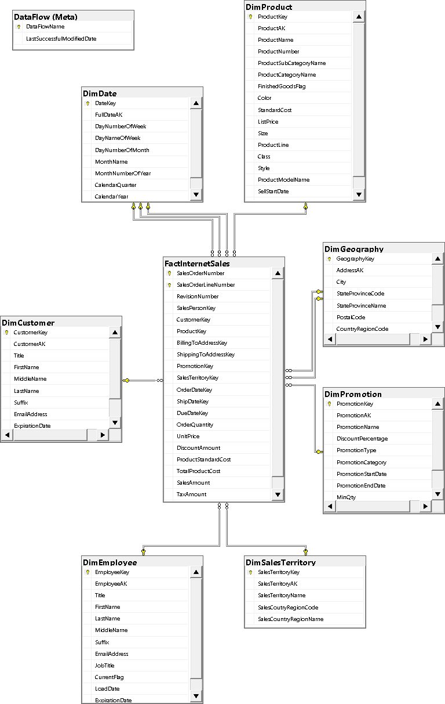
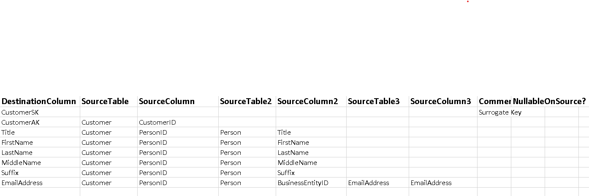
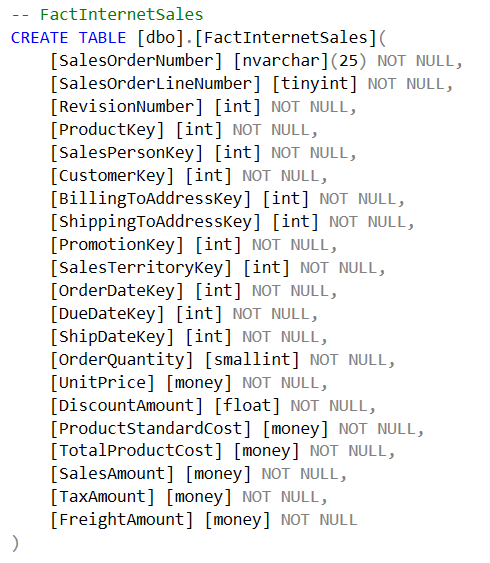

## AdventureWorks_DWH Project
This project aims to build an Internet Sales Data Mart by extracting, transforming, and loading data from the AdventureWorks 2019 database. The data mart is designed using a star schema, comprising the following dimensions: `DimPromotion`, `DimProduct`, `DimSalesTerritory`, `DimGeography`, `DimCustomer`, `DimEmployee`, `DimDate`, and a fact table: `FactInternetSales`. The ETL process is implemented using SQL Server Integration Services (SSIS) within Visual Studio.

## Data Source
Data source can be downloaded from here! [AdventureWorks2019.bak](https://github.com/Microsoft/sql-server-samples/releases/download/adventureworks/AdventureWorks2019.bak)

## Internet Sales Diagram



<p align="center">Internet Sales Diagram of the Project</p>

## Data Mapping 
The source-target of dimension and fact tables are predefined. For instances, DimCustomer is defined as figure below:



<p align="center"> Mapping Customer Source and Customer Destination (DimCustomer) </p>

## Data Modelling
### Create Dimension and Fact Tables


<p align="center">Initial Fact Table Script</p>

### Set Primary and Foreign Constraints 
- Eg: set primary key for `DimPromotion`

``` diff
- ALTER TABLE DimPromotion 
- ADD CONSTRAINT PK_DimPromotion PRIMARY KEY (PromotionKey);
```
